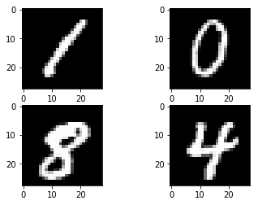

<h1>Digit Recognition</h1>
<h2>Using Keras module and tensorflow as backend</h2>
<p>Import all the basic modules like numpy,pandas,matplotlib for ploting data</p>


```python
import numpy as np
import pandas as pd
import matplotlib.pyplot as plt
%matplotlib inline
```

Import keras module for using convolutional neural network  and Maxpooling for downsampling.


```python
from keras.models import Sequential
from keras.layers import Dense
from keras.layers import Dropout
from keras.layers import Flatten
from keras.layers.convolutional import Convolution2D
from keras.layers.convolutional import MaxPooling2D
from keras.utils import np_utils
from keras import backend as K
K.set_image_dim_ordering('th')
```

    Using TensorFlow backend.


<p>Set Seed to avoid randomness.<p>


```python
seed = 7
np.random.seed(seed)
```

Reading train and test dataset.


```python
train = pd.read_csv('train.csv')
test = pd.read_csv('test.csv')
```


```python
train.head()
```


<div>
<table border="1" class="dataframe">
  <thead>
    <tr style="text-align: right;">
      <th></th>
      <th>label</th>
      <th>pixel0</th>
      <th>pixel1</th>
      <th>pixel2</th>
      <th>pixel3</th>
      <th>pixel4</th>
      <th>pixel5</th>
      <th>pixel6</th>
      <th>pixel7</th>
      <th>pixel8</th>
      <th>...</th>
      <th>pixel774</th>
      <th>pixel775</th>
      <th>pixel776</th>
      <th>pixel777</th>
      <th>pixel778</th>
      <th>pixel779</th>
      <th>pixel780</th>
      <th>pixel781</th>
      <th>pixel782</th>
      <th>pixel783</th>
    </tr>
  </thead>
  <tbody>
    <tr>
      <th>0</th>
      <td>1</td>
      <td>0</td>
      <td>0</td>
      <td>0</td>
      <td>0</td>
      <td>0</td>
      <td>0</td>
      <td>0</td>
      <td>0</td>
      <td>0</td>
      <td>...</td>
      <td>0</td>
      <td>0</td>
      <td>0</td>
      <td>0</td>
      <td>0</td>
      <td>0</td>
      <td>0</td>
      <td>0</td>
      <td>0</td>
      <td>0</td>
    </tr>
    <tr>
      <th>1</th>
      <td>0</td>
      <td>0</td>
      <td>0</td>
      <td>0</td>
      <td>0</td>
      <td>0</td>
      <td>0</td>
      <td>0</td>
      <td>0</td>
      <td>0</td>
      <td>...</td>
      <td>0</td>
      <td>0</td>
      <td>0</td>
      <td>0</td>
      <td>0</td>
      <td>0</td>
      <td>0</td>
      <td>0</td>
      <td>0</td>
      <td>0</td>
    </tr>
    <tr>
      <th>2</th>
      <td>1</td>
      <td>0</td>
      <td>0</td>
      <td>0</td>
      <td>0</td>
      <td>0</td>
      <td>0</td>
      <td>0</td>
      <td>0</td>
      <td>0</td>
      <td>...</td>
      <td>0</td>
      <td>0</td>
      <td>0</td>
      <td>0</td>
      <td>0</td>
      <td>0</td>
      <td>0</td>
      <td>0</td>
      <td>0</td>
      <td>0</td>
    </tr>
    <tr>
      <th>3</th>
      <td>4</td>
      <td>0</td>
      <td>0</td>
      <td>0</td>
      <td>0</td>
      <td>0</td>
      <td>0</td>
      <td>0</td>
      <td>0</td>
      <td>0</td>
      <td>...</td>
      <td>0</td>
      <td>0</td>
      <td>0</td>
      <td>0</td>
      <td>0</td>
      <td>0</td>
      <td>0</td>
      <td>0</td>
      <td>0</td>
      <td>0</td>
    </tr>
    <tr>
      <th>4</th>
      <td>0</td>
      <td>0</td>
      <td>0</td>
      <td>0</td>
      <td>0</td>
      <td>0</td>
      <td>0</td>
      <td>0</td>
      <td>0</td>
      <td>0</td>
      <td>...</td>
      <td>0</td>
      <td>0</td>
      <td>0</td>
      <td>0</td>
      <td>0</td>
      <td>0</td>
      <td>0</td>
      <td>0</td>
      <td>0</td>
      <td>0</td>
    </tr>
  </tbody>
</table>
<p>5 rows × 785 columns</p>
</div>


Train dataset consist of 784 pixels i.e image of dimension 28x28 and label which classified into one of 0-9 numbers.Remove label column from dataset to work on image processing and save label for later use and  drop the label column from train dataset.


```python
target = train.label
train.drop(['label'],axis=1,inplace=True)
```

Visualize sample dataset.To get idea on how the digits appear using matplotlib.


```python
plt.subplot(221)
plt.imshow(train.iloc[0].values.reshape(28,28), cmap=plt.get_cmap('gray'))
plt.subplot(222)
plt.imshow(train.iloc[5].values.reshape(28,28), cmap=plt.get_cmap('gray'))
plt.subplot(223)
plt.imshow(train.iloc[10].values.reshape(28,28), cmap=plt.get_cmap('gray'))
plt.subplot(224)
plt.imshow(train.iloc[49].values.reshape(28,28), cmap=plt.get_cmap('gray'))
plt.show()
```





When a data is passed in a neural network it is best to normalize in a way that the values lie between (0,1) which makes computation easy.Then convert the train and test dataset to numpy arrays.


```python
train = train/255
test = test/255
```


```python
train = train.values
test = test.values
```

Now make a catogery of target and reshape the train and test to 1x28x28x i.e pixel x width x height.


```python
target = np_utils.to_categorical(target)
```


```python
train = train.reshape(train.shape[0], 1, 28, 28).astype('float32')
test = test.reshape(test.shape[0], 1, 28, 28).astype('float32')
```

Get number of classes from target and number of pixles.


```python
num_classes = target.shape[1]
num_pixels = 784
```

Make baseline model for convonlutional neural network 
    <ul>
    <li>Convolutional layer consist of two layers one with 60 activation maps filter 3x3 and other with 70 activation map with 5x5 and relu  function.</li>
    <li>Next we define a pooling layer that takes the max called MaxPooling2D. It is configured with a pool size of 2×2.</li>
    <li>The next layer is a regularization layer using dropout called Dropout.</li>
<li>Next is a layer that converts thematrix data to a vector called Flatten. It allows the output to be processed by standard fully connected layers.</li>
<li>Fully connected layer with 128 neurons and rectifier activation function.</li>
<li>Next the output layer has 10 neurons for the 10 classes and a softmax activation function to output probability-like predictions for each class.</li>
    </ul>


```python
def baseline_model():
	# create model
	model = Sequential()
	model.add(Convolution2D(60, 3, 3, border_mode='valid', input_shape=(1, 28, 28), activation='relu'))
	model.add(MaxPooling2D(pool_size=(2, 2)))
	model.add(Convolution2D(70, 5, 5, activation='relu'))
	model.add(MaxPooling2D(pool_size=(2, 2)))
	model.add(Dropout(0.2))
	model.add(Flatten())
	model.add(Dense(128, activation='relu'))
	model.add(Dense(num_classes, activation='softmax'))
	# Compile model
	model.compile(loss='categorical_crossentropy', optimizer='adam', metrics=['accuracy'])
	return model
```

Now fit the model and Evaluate the scores with  epoch 10 bath_size 200 and print baseline error.


```python
model = baseline_model()
model.fit(train, target,  nb_epoch=10, batch_size=200, verbose=2)
scores = model.evaluate(train, target, verbose=0)
print("Baseline Error: %.2f%%" % (100-scores[1]*100))
```

    Epoch 1/10
    304s - loss: 0.2818 - acc: 0.9186
    Epoch 2/10
    303s - loss: 0.0717 - acc: 0.9780
    Epoch 3/10
    302s - loss: 0.0511 - acc: 0.9842
    Epoch 4/10
    303s - loss: 0.0382 - acc: 0.9885
    Epoch 5/10
    303s - loss: 0.0311 - acc: 0.9899
    Epoch 6/10
    303s - loss: 0.0259 - acc: 0.9914
    Epoch 7/10
    303s - loss: 0.0204 - acc: 0.9934
    Epoch 8/10
    305s - loss: 0.0181 - acc: 0.9943
    Epoch 9/10
    304s - loss: 0.0171 - acc: 0.9946
    Epoch 10/10
    304s - loss: 0.0145 - acc: 0.9953
    Baseline Error: 0.21%


Now predict the above model on test dataset to make predictions and take max of all the classes to classify as digit. 


```python
yPred = model.predict(test, batch_size=200, verbose=0)
y_index = np.argmax(yPred,axis=1)
```

Optional:save the file into csv.


```python
with open('conv3l3m_out.csv', 'w') as f :
    f.write('ImageId,Label\n')
    for i in range(0,len(test)) :
        f.write("".join([str(i+1),',',str(y_index[i]),'\n']))
```

Kaggle is the dataset source and model gave accuracy around 0.99043.
